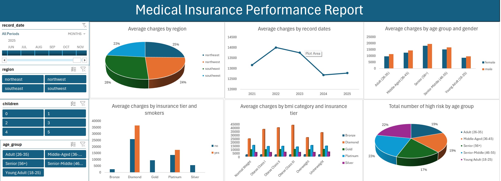

# Data Analytics Portfolio
## Project 1

**Title:** [Amazon E-commerce Performance Dashboard](https://github.com/WillisOguwike/WillisOguwike.github.io/blob/main/amazon_sales_dataset.xlsx)

**Tools Used:** Microsoft Excel (pivot table, pivot chart, power query editor, slicers, conditional formating, text box)

**Project Description:**

**Key findings:**

**Dashboard Overview**

## Project 2

**Title:** [Medical Insurance Performance Report](https://github.com/WillisOguwike/WillisOguwike.github.io/blob/main/medical_insurance_2026_kaggle.xlsx)

**Tools Used:** Microsoft Excel (pivot table, pivot chart, power query editor, slicers, conditional formating, text box).

**Project Description:**

**Key findings:**

**Dashboard Overview:**

 
## Project 3
**Title:** SQL Data Manipulation Language-Employee_Data

**SQL Code:** [Employee Data](https://github.com/WillisOguwike/WillisOguwike.github.io/blob/main/Employee_data.sql)

**SQL Skills Used:**

**Project Description:**

**Technology used:** SQL server

