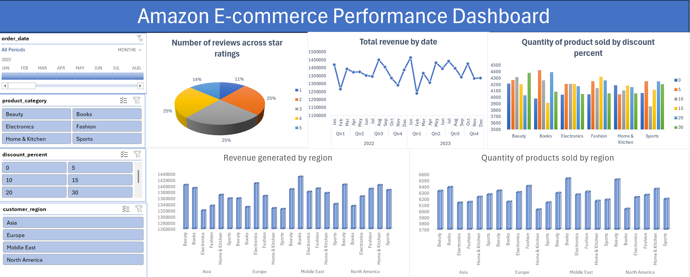
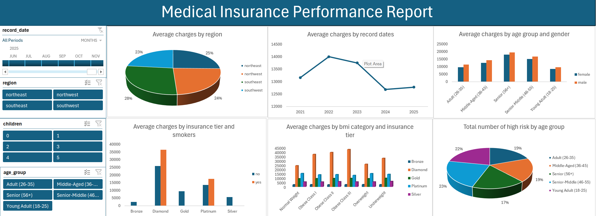
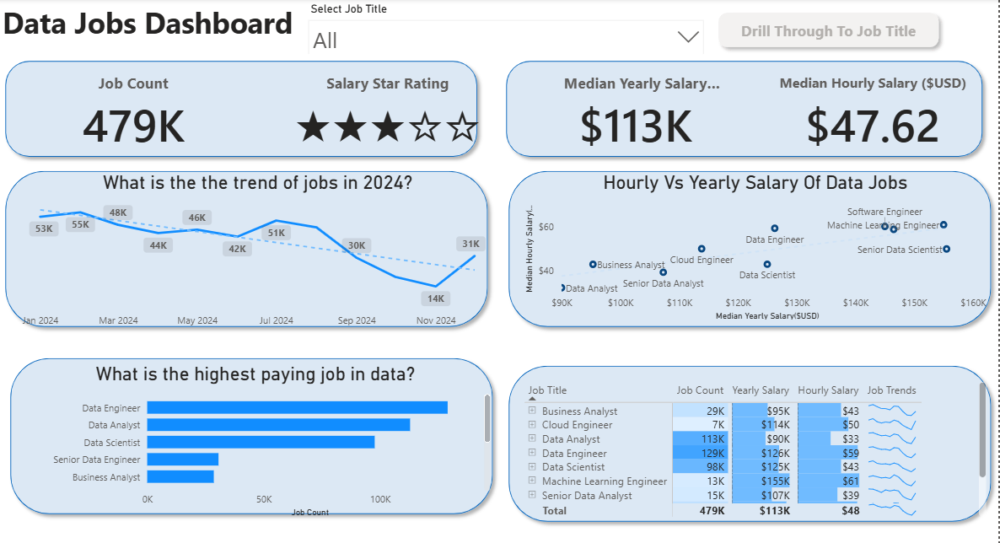
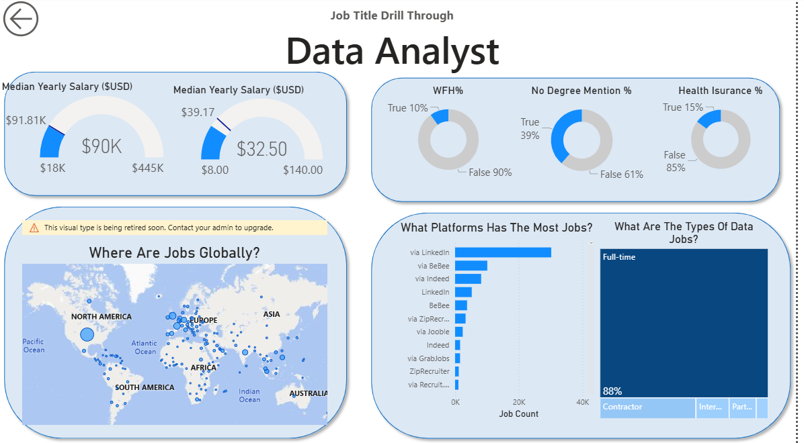
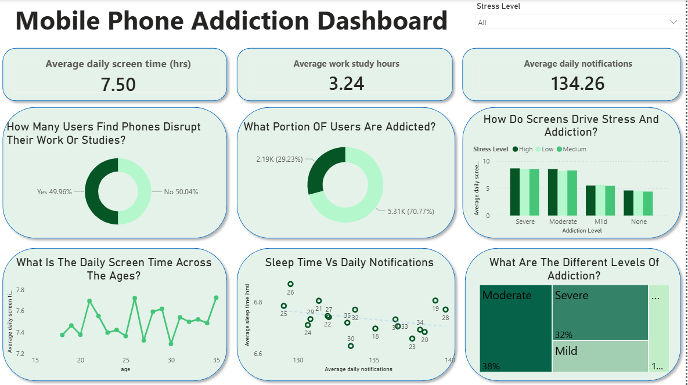

# Data Analytics Portfolio
## Project 1

**Title:** [Amazon E-commerce Performance Dashboard](https://github.com/WillisOguwike/WillisOguwike.github.io/blob/main/amazon_sales_dataset.xlsx)

**Tools Used:** Microsoft Excel (pivot table, pivot chart, power query editor, slicers, conditional formating, text box)

**Project Description:**

This project involved analysing product data of Amazon ecommerce store to identify trends and patterns in sales performance for 2022 and 2023. This dashboard allows stakeholders to easily monitor and analyze the company’s performance across different regions, products, and time periods. The dashboard includes the following features:

* Number Of Reviews Across Star Ratings: Visual representation of star ratings (1-5) broken down by percentage.

* Total Revenue By Month: A monthly breakdown of the revenue generated, providing insights into sales trends over time.

* Quantity Of Product Sold By Discount Percent: Displays the quantity of categories of products sold by percentage discounts (0%-30%), allowing for easy comparison of quantity sold over product categories and discount.

* Revenue Generated By Regions And Product Categories: Highlights the total revenue generated from each region further brokendown by product categories, showcasing the performance in different markets.

* Quantity Of Product Sold By Regions And Product Categories: Highlights the quantity of product sold by each region further brokendown by product categories.

Additionally, the dashboard includes interactive slicers and timeline for:

* Month: Filter the data to view performance for a specific month or range of months.

* Product Category: Drill down into the performance of individual product category.

* Discount Percent: Filter the data by percentage discount.

* Region: Focus on the analysing regional performance.

**Key findings:**

* Regional Profitability: Identified the most profitable regions and highlighted regions where performance could be improved.

* Seasonal Trends: Revealed patterns in sales and revenue that correspond with seasonal events, allowing for more strategic planning.

* Top-Performing Products: Highlighted which product category are driving the most revenue, aiding in inventory and marketing decisions.

* Sales Volatility: Analyzed monthly sales fluctuations to understand market dynamics and adjust business strategies accordingly.

* This dashboard serves as a crucial tool for the Amazon ecommerce management team, providing clear, actionable insights that drive informed decision-making and strategic planning.

**Dashboard Overview**

## Project 2

**Title:** [Medical Insurance Performance Report](https://github.com/WillisOguwike/WillisOguwike.github.io/blob/main/medical_insurance_2026_kaggle.xlsx)

**Tools Used:** Microsoft Excel (pivot table, pivot chart, power query editor, slicers, conditional formating, text box).

**Project Description:**

This project involved analysing medical insurance data to identify trends and patterns in healthcare expenditure across various demographics and regions from 2021 to 2025. It is designed to provide a comprehensive overview of key insurance metrics. This dashboard allows stakeholders to easily monitor and analyze average charges across different populations, health categories, and time periods. The dashboard includes the following features:

* Average Charges by Region: A pie chart representing the distribution of insurance costs across the Northeast, Northwest, Southeast, and Southwest.
* Average Charges by Record Dates: A line graph tracking the fluctuation of average insurance costs over a five-year period.
* Average Charges by Age Group and Gender: A grouped bar chart comparing insurance costs between males and females across five distinct life stages.
* Average Charges by BMI Category and Insurance Tier: A complex bar chart breaking down costs based on weight categories (Underweight to Obese Class III) and specific insurance plan levels (Bronze to Silver).
* Average Charges by Insurance Tier and Smokers: A comparative bar chart highlighting the significant cost difference between smokers and non-smokers across different plan tiers.
* Total Number of High Risk by Age Group: A pie chart visualizing the percentage of high-risk individuals categorized by age range.

Additionally, the dashboard includes interactive slicers and a timeline for:

* Record Date (Timeline): Filter data to view performance for specific months or years.
* Region: Focus on specific geographical areas to analyze local cost trends.
* Children: Drill down into how the number of dependents (0–5) impacts insurance charges.
* Age Group: Filter the entire report to focus on specific demographic segments.

**Key Findings**

* Regional Cost Distribution: Insurance charges are relatively evenly distributed across regions, though the Southeast (28%) and Northeast (25%) represent the highest average charges.
* Impact of Lifestyle on Cost: Smoking status is a primary driver of high insurance charges, particularly within the Diamond and Platinum tiers, where smokers face drastically higher costs than non-smokers.
* Correlation Between BMI and Plan Tier: There is a visible trend where individuals in Obese Class II and III categories incur significantly higher charges, especially those enrolled in Bronze and Diamond plans.
* Age and Gender Trends: The Senior (56+) age group consistently incurs the highest average charges, with males typically seeing slightly higher costs in the older demographics compared to females.
* Historical Volatility: Average insurance charges saw a significant peak in 2022, followed by a sharp decline in 2024, before beginning to stabilize/rise again in 2025.
* High-Risk Demographics: The Adult (26-35) and Young Adult (18-25) segments represent the largest portions of the "High Risk" pool, accounting for 22% and 19% respectively.

------------------------------
This dashboard serves as a crucial tool for the insurance company’s management team, providing clear, actionable insights into risk factors and cost drivers that inform premium adjustments and strategic planning.

**Dashboard Overview:**

 
## Project 3

**Title:** SQL Data Manipulation Language-Employee_Data

**SQL Code:** [Employee Data](https://github.com/WillisOguwike/WillisOguwike.github.io/blob/main/Employee_data.sql)

**SQL Skills Used:**

**Project Description:**

**Technology used:** SQL server

## Project 4

**Title:** [Data Jobs Dashboard](https://github.com/WillisOguwike/WillisOguwike.github.io/blob/main/Data%20Jobs%20dashboard.pbix)

**Tools Used:** Power BI (slicers, button, drill-through, tables, power query editor, implicit measure)

**Project Description:**

**Key findings:**

**Dashboard Overview:**

**Dashboard Drill-down**

## Project 5

**Title:** [Mobile Phone Addiction Dashboard](https://github.com/WillisOguwike/WillisOguwike.github.io/blob/main/Smartphone%20Usage%20Addiction%20Analysis.pbix)

**Tools Used:** Power BI (slicers, button, drill-through, tables, power query editor, implicit measure)

**Project Description:**

**Key findings:**

**Dashboard Overview** 

 

